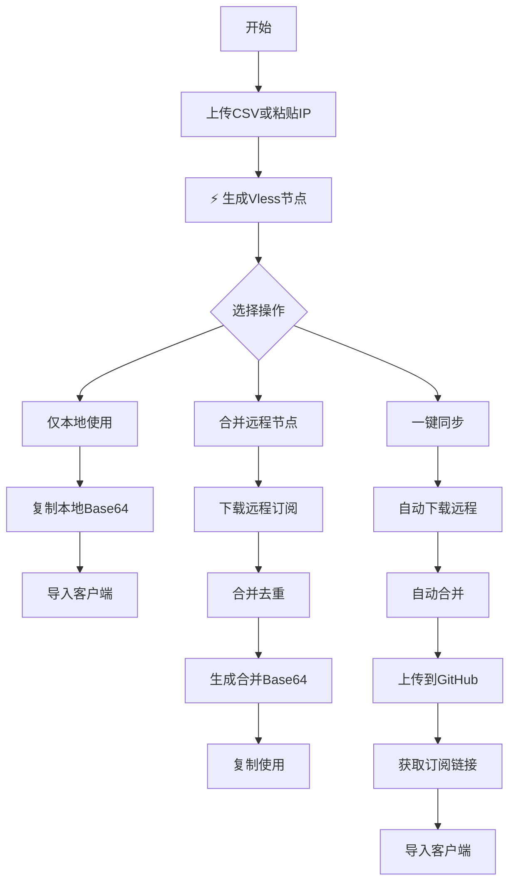

# Vless节点生成工具3.0版

## 🚀 快速开始

### 快速访问链接（一键复制）
以下是三个核心订阅链接，点击即可快速复制：

  

    <label>📍 LocationNode 本地节点：</label>
    

      <input type="text" readonly value="https://daizhouhui.github.io/CustomNode/LocationNode">
      <button class="copy-btn" onclick="copyLink('https://daizhouhui.github.io/CustomNode/LocationNode')">📋 复制</button>
      <button class="open-btn" onclick="window.open('https://daizhouhui.github.io/CustomNode/LocationNode', '_blank')">🌐 打开</button>
    

  

  
  

    <label>🔗 MainNode 合并节点：</label>
    

      <input type="text" readonly value="https://daizhouhui.github.io/CustomNode/MainNode">
      <button class="copy-btn" onclick="copyLink('https://daizhouhui.github.io/CustomNode/MainNode')">📋 复制</button>
      <button class="open-btn" onclick="window.open('https://daizhouhui.github.io/CustomNode/MainNode', '_blank')">🌐 打开</button>
    

  

  
  

    <label>📄 PlainNode 明文节点：</label>
    

      <input type="text" readonly value="https://daizhouhui.github.io/CustomNode/PlainNode">
      <button class="copy-btn" onclick="copyLink('https://daizhouhui.github.io/CustomNode/PlainNode')">📋 复制</button>
      <button class="open-btn" onclick="window.open('https://daizhouhui.github.io/CustomNode/PlainNode', '_blank')">🌐 打开</button>
    

  

## 📱 核心订阅链接

| 文件类型 | 订阅链接 | 用途 | 一键操作 |
|---------|---------|------|---------|
| **LocationNode** | `https://daizhouhui.github.io/CustomNode/LocationNode` | 本地生成的节点Base64订阅 | [复制](javascript:copyLink('https://daizhouhui.github.io/CustomNode/LocationNode')) \| [打开](https://daizhouhui.github.io/CustomNode/LocationNode) |
| **MainNode** | `https://daizhouhui.github.io/CustomNode/MainNode` | 合并后的Base64订阅（推荐） | [复制](javascript:copyLink('https://daizhouhui.github.io/CustomNode/MainNode')) \| [打开](https://daizhouhui.github.io/CustomNode/MainNode) |
| **PlainNode** | `https://daizhouhui.github.io/CustomNode/PlainNode` | 合并后的明文节点 | [复制](javascript:copyLink('https://daizhouhui.github.io/CustomNode/PlainNode')) \| [打开](https://daizhouhui.github.io/CustomNode/PlainNode) |

## 🔧 工具界面快速导航

### 左侧面板（数据输入）
1. **📤 CSV数据源** - 上传或粘贴IP列表
2. **📊 CSV列配置** - 设置IP和端口列位置
3. **📝 节点配置** - 设置端口、别名、自动识别等
4. **⚡ 生成操作** - 一键生成Vless节点

### 右侧面板（结果输出）
1. **🔗 Vless节点链接** - 本地生成的明文节点
2. **🔗 Base64订阅** - 本地自动生成的Base64订阅
3. **🔄 手动转换** - Vless转Base64工具
4. **💾 下载结果** - 下载本地生成的文件
5. **🐙 GitHub同步** - 同步到GitHub仓库

## ⚡ 快速操作指南

### 方案一：仅使用本地节点（最简单）
1. **粘贴IP列表**到左侧文本区域（每行一个IP）
2. 点击 **⚡ 生成Vless节点**
3. 复制 **本地Base64订阅** 内容
4. 直接导入到Clash、Shadowrocket等工具

### 方案二：合并本地和远程节点（推荐）
1. 粘贴或上传IP列表
2. 点击 **⚡ 生成Vless节点**
3. 点击 **🔄 本地与远程节点合并**
4. 复制 **合并的Base64订阅** 内容
5. 点击 **📤 本地Base64订阅上传** 保存到GitHub

### 方案三：一键全自动同步
1. 配置好GitHub Token和仓库信息
2. 粘贴IP列表并生成节点
3. 点击 **🚀 一键同步**
4. 工具会自动：下载远程 → 合并去重 → 上传到GitHub

## 📋 订阅链接使用说明

### 1. LocationNode订阅
- **链接**: `https://daizhouhui.github.io/CustomNode/LocationNode`
- **用途**: 仅包含本地生成的节点
- **适合**: 临时使用、测试新节点
- **特点**: 更新快，只包含最新生成的节点

### 2. MainNode订阅（主订阅）
- **链接**: `https://daizhouhui.github.io/CustomNode/MainNode`
- **用途**: 本地+远程合并去重后的完整订阅
- **适合**: 日常使用、主力订阅
- **特点**: 节点最全，包含所有历史有效节点

### 3. PlainNode订阅
- **链接**: `https://daizhouhui.github.io/CustomNode/PlainNode`
- **用途**: 明文节点文件，供其他工具调用
- **适合**: 开发者、需要明文数据的场景
- **特点**: 双重Base64编码，可直接解码使用

## 🔄 一键同步流程

### 完整工作流程

### 按钮功能说明
| 按钮 | 功能 | 产出 |
|------|------|------|
| **⚡ 生成Vless节点** | 从CSV/IP列表生成节点 | 本地Vless链接 + 本地Base64 |
| **🔄 本地与远程节点合并** | 下载并合并远程节点 | 合并后的Base64订阅 |
| **📤 本地Base64订阅上传** | 上传本地节点到LocationNode | LocationNode订阅链接 |
| **📤 合并的Vless上传** | 上传明文节点到PlainNode | PlainNode订阅链接 |
| **📤 合并的订阅上传** | 上传Base64订阅到MainNode | MainNode订阅链接 |
| **🚀 一键同步** | 自动完成合并和上传 | 所有三个订阅链接 |

## 📱 客户端导入指南

### Clash客户端
1. 复制Base64订阅链接
2. 打开Clash → 配置 → 新建配置
3. 选择URL导入，粘贴链接
4. 应用配置并启用

### Shadowrocket（iOS）
1. 点击右上角"+"号
2. 选择"Subscribe"
3. 粘贴Base64订阅链接
4. 点击Download完成

### Quantumult X
1. 进入设置 → 订阅
2. 添加订阅，粘贴链接
3. 资源标签填写"节点"
4. 保存并更新

### V2rayNG（Android）
1. 点击右上角"+"号
2. 选择"订阅设置"
3. 添加订阅，粘贴链接
4. 更新订阅

## ⚠️ 注意事项

### 订阅链接有效期
- 链接永久有效，除非删除GitHub仓库
- 内容会随着上传操作更新
- 建议定期更新订阅获取最新节点

### 安全提示
1. **GitHub Token**：仅保存在本地浏览器，不上传服务器
2. **节点信息**：所有节点在本地生成，不上传第三方
3. **订阅链接**：公开可访问，不要包含敏感信息

### 性能优化
1. **大文件处理**：建议单次处理不超过1000个IP
2. **浏览器兼容**：使用Chrome/Edge最新版
3. **网络要求**：需要能访问GitHub API

## 🔧 高级配置

### 自定义订阅路径
在GitHub配置区域可以修改：
- **MainNode**：主订阅文件路径
- **PlainNode**：明文节点文件路径  
- **LocationNode**：本地节点文件路径

### 批量处理技巧
1. **分批次处理**：大量IP可分多次处理
2. **合并去重**：每批处理后可合并到MainNode
3. **定期清理**：定期检查并清理无效节点

## 💡 使用技巧

### 快速复制技巧
1. 直接点击本文档中的一键复制按钮
2. 在工具界面使用"复制全部Vless链接"
3. 使用"一键复制Base64"快速获取订阅

### 节点管理技巧
1. **按地区分类**：启用自动识别，节点按地区命名
2. **端口统一**：使用强制443端口功能
3. **别名优化**：设置合适的前缀便于识别

### 故障排除
1. **无法生成节点**：检查IP格式是否正确
2. **GitHub同步失败**：检查Token权限和仓库名称
3. **导入失败**：检查Base64格式是否正确

## 📞 快速帮助

### 常见问题
1. **Q**: 如何获取订阅链接？
   **A**: 点击本文档中的一键复制按钮，或在工具中上传后获取

2. **Q**: 三种订阅有什么区别？
   **A**: LocationNode(最新本地节点)，MainNode(完整合并节点)，PlainNode(明文备份)

3. **Q**: 如何更新订阅？
   **A**: 重新生成节点并上传，或使用一键同步功能

### 紧急联系方式
- **GitHub Issues**: [提交问题报告](https://github.com/DaiZhouHui/CustomNode/issues)
- **更新日志**: 查看最新功能和修复

---

**一键复制提示**：点击上方蓝色"复制"按钮可直接复制订阅链接到剪贴板，红色"打开"按钮可在新窗口查看订阅内容。